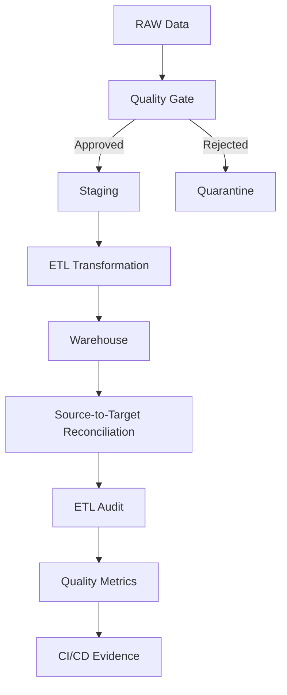

# QA Data Quality & ETL Engineering

[](https://github.com/jaquelineleite/qa-data-quality-etl-engineering/actions/workflows/data-quality-ci.yml)


Projeto de portfólio focado em **Quality Engineering aplicado a Dados**, cobrindo testes de ETL, Data Quality, reconciliação Source-to-Target, grandes volumes, SQL avançado, automação e CI/CD.

O cenário simula uma plataforma de transações financeiras em que dados passam por regras de qualidade antes de seguir para Staging e Warehouse.

---

## Arquitetura



---

## Principais capacidades

- ETL / ELT Testing
- Data Quality
- Source-to-Target Testing
- Reconciliação de dados
- Quality Gate
- Data Quarantine
- SQL avançado
- Validação de regras de transformação
- Integridade referencial
- Grandes volumes de dados
- Testes automatizados com Pytest
- Métricas de qualidade
- Base SAS
- Shift Left Quality
- GitHub Actions
- Evidências automatizadas

---

## Quality Gate

A massa RAW contém registros válidos e defeitos controlados.

Fluxo:

```text
5 registros RAW
       |
       v
 Quality Gate
    /      \
   /        \
3 válidos   2 rejeitados
   |             |
   v             v
Staging      Quarantine
```

Exemplos de regras:

```text
valor_bruto > 0
taxa >= 0
taxa <= valor_bruto
status IN ('APROVADA', 'NEGADA', 'CANCELADA')
```

Os registros inválidos recebem rastreabilidade de rejeição:

```json
{
  "quality_status": "REJECTED",
  "rejection_reasons": [
    "INVALID_GROSS_AMOUNT"
  ]
}
```

---

## ETL Pipeline

O pipeline implementa:

```text
RAW
 ↓
Quality Validation
 ↓
Staging
 ↓
Transformation
 ↓
Warehouse
 ↓
Reconciliation
 ↓
Audit
```

Regra financeira implementada:

```text
valor_liquido = valor_bruto - taxa
```

Exemplo:

```text
valor_bruto:   150.00
taxa:            5.00
valor_liquido: 145.00
```

---

## SQL Avançado

A suíte SQL utiliza:

- CTE
- Window Functions
- ROW_NUMBER()
- LAG()
- PARTITION BY
- FULL OUTER JOIN
- EXCEPT
- COALESCE
- CASE
- GROUP BY
- SUM
- COUNT

As consultas cobrem:

- NULLs
- duplicidades
- integridade referencial
- regras de negócio
- transformações
- reconciliação financeira
- comparação detalhada origem × destino

---

## Data Quality

| Dimensão | Exemplo |
|---|---|
| Completeness | campos obrigatórios |
| Uniqueness | IDs duplicados |
| Validity | domínio e formato |
| Consistency | comparação entre camadas |
| Accuracy | regras de transformação |
| Integrity | relacionamento entre entidades |
| Reconciliation | origem × destino |

---

## Grandes volumes

O projeto gera automaticamente um dataset sintético de **100.000 registros**.

| Métrica | Resultado |
|---|---:|
| Total | 100.000 |
| Válidos | 99.000 |
| Inválidos únicos | 1.000 |
| Invalid Amount | 500 |
| Invalid Fee | 500 |
| Invalid Status | 500 |
| Null Records | 0 |
| Duplicate IDs | 0 |
| Data Quality Score | 99,0% |
| Tempo local | ~0,17 s |

> O tempo é apenas uma referência de execução local e varia conforme o ambiente.

A massa de 100 mil registros é gerada durante a execução e não é versionada.


---

## Automação de Testes

Stack principal:

```text
Python 3.12
Pytest
Pandas
pytest-html
```

Estrutura de testes:

```text
tests/
├── data-quality/
├── integration/
└── volume/
```

Execução utilizada pelo CI:

```bash
python -m pytest \
  tests/volume \
  tests/integration \
  tests/data-quality/test_quality_gate.py \
  -v
```

Resultado atual no CI:

```text
47 passed
1 skipped (benchmark opcional de 1M)
```

Localmente, com o dataset de 1 milhão gerado, o teste adicional também é executado com sucesso.

---

## ETL Audit e Reconciliação

A auditoria valida:

```text
source_records
staging_records
warehouse_records
rejected_records
missing_in_warehouse
extra_in_warehouse
reconciliation_status
```

Resultado esperado:

```text
Source:         5
Staging:        3
Warehouse:      3
Rejected:       2
Reconciliation: PASSED
```

---

## SAS

O projeto possui scripts Base SAS para:

- importação de CSV;
- validação de completude;
- identificação de duplicidades;
- cruzamento entre bases;
- Source-to-Target Reconciliation;
- análise financeira;
- regras de negócio.

```text
sas/
├── 01_import_csv.sas
├── 02_duplicate_validation.sas
├── 03_completeness_validation.sas
├── 04_source_target_reconciliation.sas
├── 05_financial_analysis.sas
└── 06_business_rules_validation.sas
```

> Os scripts SAS requerem um ambiente SAS para execução.

---

## Formatos de Dados

Atualmente o projeto trabalha com:

```text
CSV
JSON
TXT
```

Exemplos:

```text
data/raw/csv/clientes.csv
data/raw/json/transacoes.json
data/raw/txt/cancelamentos.txt
```

A validação de arquivos Excel está prevista no roadmap.

---

## Shift Left Quality

A estratégia de qualidade começa no refinamento dos requisitos.

A documentação inclui:

- Data Quality Strategy;
- Acceptance Criteria;
- Risk Analysis;
- Source-to-Target Mapping;
- Defect Documentation;
- Test Execution.

Fluxo:

```text
Requisito
   ↓
Critério de Aceite
   ↓
Análise de Risco
   ↓
Data Quality Rule
   ↓
Teste Automatizado
```

---

## Gestão de Defeitos

O projeto contém defeitos de dados documentados:

```text
docs/defects/
├── BUG-DATA-001.md
└── BUG-DATA-002.md
```

Os registros incluem severidade, prioridade, impacto, evidência, resultado esperado e regra violada.

---

## CI/CD

GitHub Actions executa automaticamente:

```text
Checkout
   ↓
Setup Python
   ↓
Install Dependencies
   ↓
Generate 100K Dataset
   ↓
Generate Data Quality Metrics
   ↓
Execute ETL
   ↓
Execute ETL Audit
   ↓
Run Automated Tests
   ↓
Upload Evidence
```

O pipeline é disparado em:

```text
push → main
pull request → main
```

As evidências são disponibilizadas como artifacts da execução.

---

## PostgreSQL e Docker

A estrutura para PostgreSQL já está preparada com as camadas:

```text
source
staging
warehouse
```

Incluindo:

```text
source.clientes
source.estabelecimentos
source.transacoes

staging.clientes
staging.estabelecimentos
staging.transacoes

warehouse.dim_cliente
warehouse.dim_estabelecimento
warehouse.fact_transacao
```

O repositório também contém:

```text
docker-compose.yml
```

A integração runtime com PostgreSQL e Docker está implementada e validada por testes automatizados de estrutura, transformação, qualidade e reconciliação.

---

## Estrutura do Projeto

```text
qa-data-quality-etl-engineering/
├── .github/workflows/
├── data/
├── database/init/
├── docs/
├── etl/
├── sas/
├── scripts/
├── sql/
├── tests/
├── docker-compose.yml
├── pytest.ini
├── requirements.txt
└── README.md
```

---

## Roadmap

- [x] Data Quality Strategy
- [x] Quality Gate
- [x] Data Quarantine
- [x] SQL avançado
- [x] ETL automatizado
- [x] Source-to-Target Reconciliation
- [x] ETL Audit
- [x] Scripts SAS
- [x] Dataset de 100K registros
- [x] Data Quality Metrics
- [x] Pytest
- [x] GitHub Actions
- [x] Evidências automatizadas
- [x] Excel validation
- [x] PostgreSQL runtime integration
- [x] Docker integration
- [x] Database automated tests
- [x] Dataset de 1 milhão de registros

---

## Benchmark de Grandes Volumes

Além da massa padrão de 100 mil registros, o projeto possui validação local opcional com **1 milhão de transações sintéticas**.

| Dataset | Registros válidos | Registros inválidos | Data Quality Score | Tempo de referência |
|---|---:|---:|---:|---:|
| 100K | 99.000 | 1.000 | 99,0% | 0,1242 s |
| 1M | 990.000 | 10.000 | 99,0% | 1,2417 s |

Os resultados acima correspondem a uma execução local de referência e podem variar conforme hardware e ambiente.

O dataset de 1 milhão de registros é gerado localmente e está excluído do controle de versão por meio do `.gitignore`.

### Validação de 1 milhão de registros

```bash
python scripts/generate_large_dataset.py \
  --records 1000000 \
  --output transacoes_1m.csv

python -m pytest tests/volume/test_million_records.py -v
A validação verifica:

- 1.000.000 de registros processados;
- 990.000 registros válidos;
- 10.000 registros inválidos únicos;
- ausência de IDs duplicados;
- ausência de campos obrigatórios nulos;
- Data Quality Score de 99%.

No ambiente de CI, o teste de 1 milhão é ignorado caso a massa local não exista, evitando versionamento de arquivos de grande volume.

---

## Autor

**Jaqueline Fernandes de Andrade**

Quality Assurance | Quality Engineering | Test Automation | Data Quality

---
